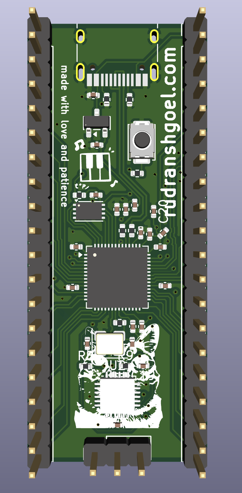
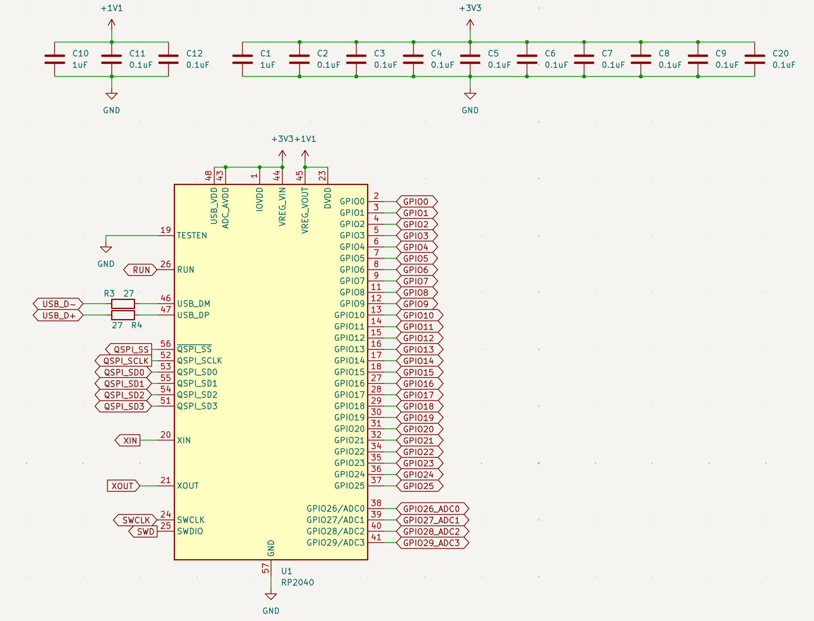
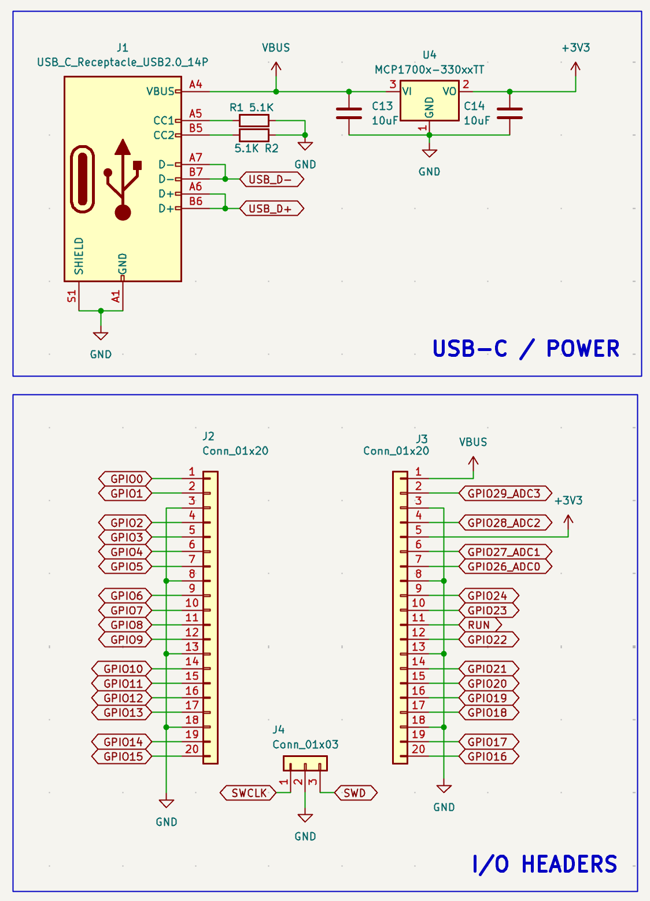
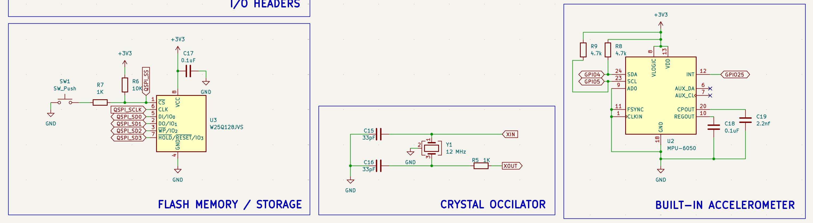
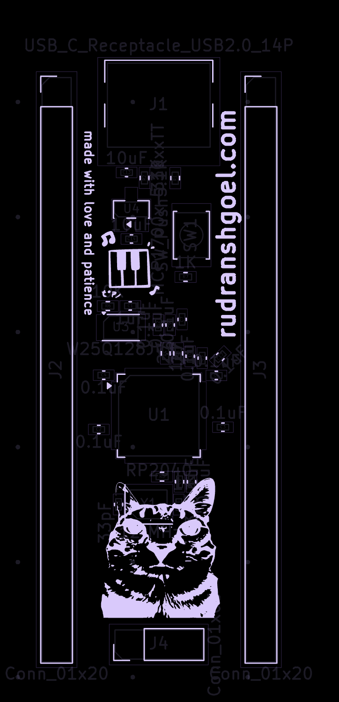
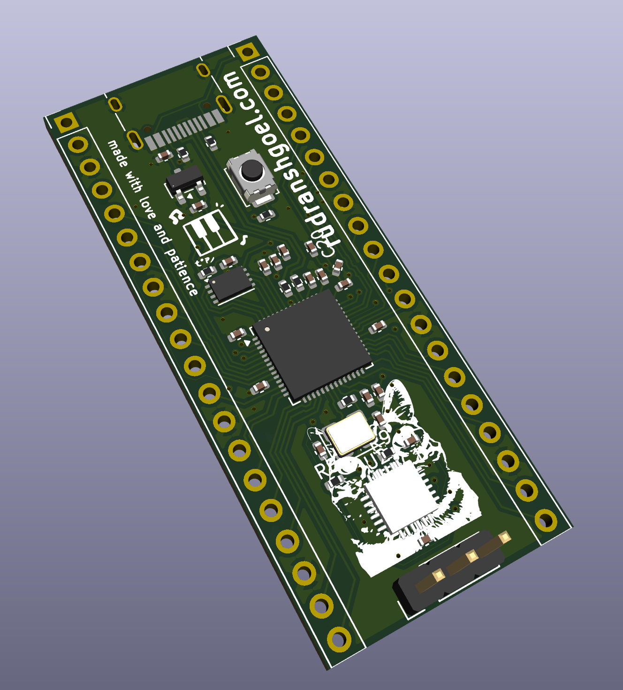
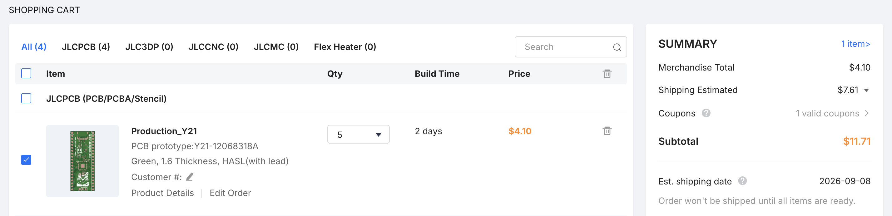

# RP2040 Devboard

### Why did I make it?
bcz i need more hardware projects in my portfolio and also because it seemed like a fun hardware project which was not at all beginner friendly but still pretty interesting.

### What was the hardest part about this ?
routing. routing was hell. nevertheless, we did it.

Features:

- rp2040 chip
- usb-c for power
- flash memory/storage
- crystal occilator
- Custom PCB Art (really cool)

### Schematic

### PCB 

### 3D view of all parts 

## BOM

[BOM](BOM.csv)

PCB Cost - $11.71 [ shipping included ]
Components Cost - $18.65

Final Price comes out to be 2,868.63 INR ($30.36)

## Total Pricing
(reviewers, i have a jlcpcb coupon for $15, so the pcb cost get's nullified, so the total cost for me is $18.65, but for others it would be the price given below)
The total price comes out to be 2,868.63 INR ($30.36) [ SHIPPING INCLUDED ]

The pricing might slightly vary due to flash sales, and dollar market trends.