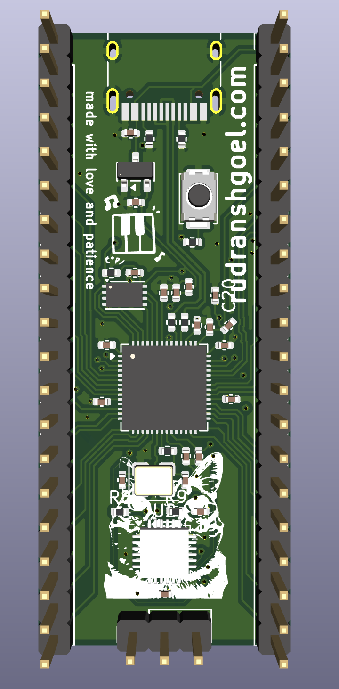
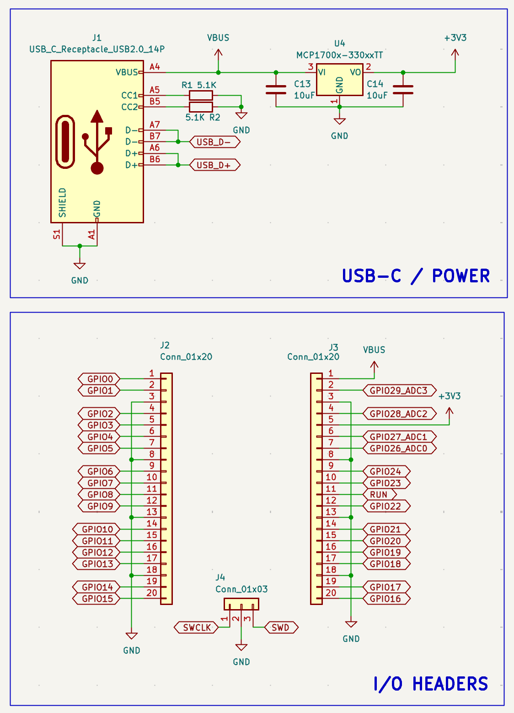
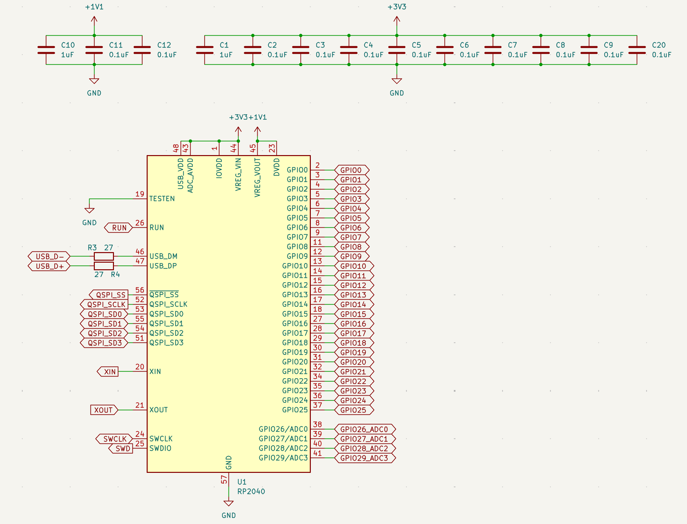
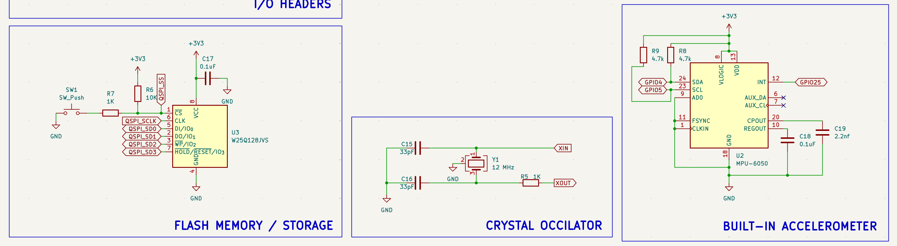
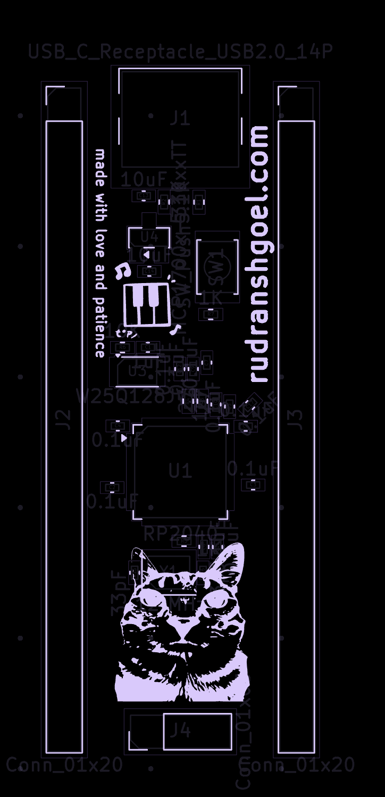
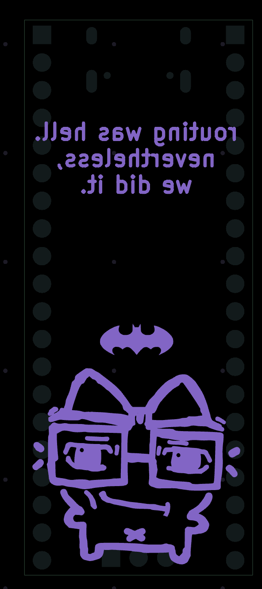
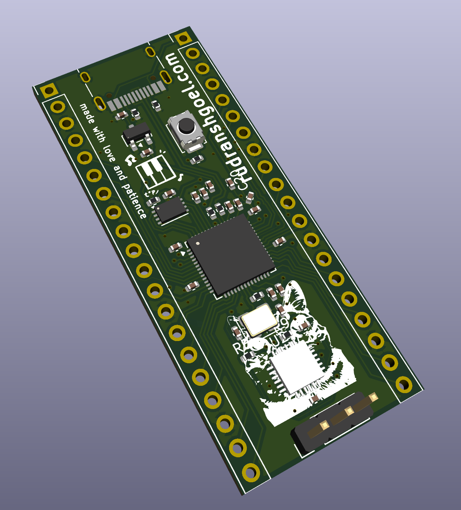
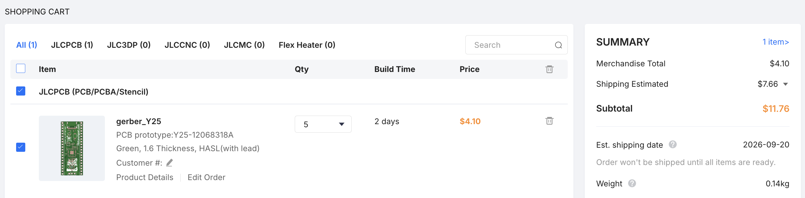

# RP2040 Devboard

### Why did I make it?
bcz i need more hardware projects in my portfolio and also because it seemed like a fun hardware project which was not at all beginner friendly but still pretty interesting.

### What was the hardest part about this ?
routing. routing was hell. nevertheless, we did it.

### assembly?
going to hand solder each thing, if you want to do pcba (i can't due to budget reasons), go to the production folder and get the BOM and CPL for jlcpcb pcba service.

Features:

- rp2040 chip
- usb-c for power
- flash memory/storage
- crystal occilator
- built in accelerometer for cool shit
- Custom PCB Art (really cool)
- led

### Schematic

### PCB 

### 3D view of all parts 

## BOM

[BOM](BOM.csv)

|Comment                    |Designator                         |Footprint                                  |JLCPCB Part #|Price  |Source     |
|---------------------------|-----------------------------------|-------------------------------------------|-------------|-------|-----------|
|1uF                        |C10,C1                             |C_0402_1005Metric                          |C52923       |$0.2420|JLCPCB PCBA|
|MCP1700x-330xxTT           |U4                                 |SOT-23                                     |C39051       |$2.0390|JLCPCB PCBA|
|33pF                       |C15,C16                            |C_0402_1005Metric                          |C1562        |$0.1140|JLCPCB PCBA|
|1K                         |R7,R5                              |R_0402_1005Metric                          |C11702       |$0.0780|JLCPCB PCBA|
|5.1K                       |R2,R1                              |R_0402_1005Metric                          |C25905       |$0.0860|JLCPCB PCBA|
|12MHz                      |Y1                                 |Crystal_SMD_3225-4Pin_3.2x2.5mm            |C9002        |$0.6629|JLCPCB PCBA|
|10uF                       |C13,C14                            |C_0402_1005Metric                          |C19702       |$0.7000|JLCPCB PCBA|
|RP2040                     |U1                                 |QFN-56-1EP_7x7mm_P0.4mm_EP3.2x3.2mm        |C2040        |$4.9625|JLCPCB PCBA|
|0.1uF                      |C8,C17,C12,C4,C3,C5,C6,C2,C11,C7,C9|C_0402_1005Metric                          |C1525        |$0.3575|JLCPCB PCBA|
|W25Q128JVS                 |U3                                 |Winbond_USON-8-1EP_3x2mm_P0.5mm_EP0.2x1.6mm|C2843335     |$7.8700|JLCPCB PCBA|
|10K                        |R6                                 |R_0402_1005Metric                          |C25744       |$0.0380|JLCPCB PCBA|
|USB_C_Receptacle_USB2.0_14P|J1                                 |USB_C_Receptacle_HRO_TYPE-C-31-M-12        |C165948      |$0.9280|JLCPCB PCBA|
|27                         |R4,R3                              |R_0402_1005Metric                          |C25100       |$0.0704|JLCPCB PCBA|
|SW_Push                    |SW1                                |SW_Push_SPST_NO_Alps_SKRK                  |C720477      |$0.5004|JLCPCB PCBA|

PCB Cost - $11.76 [ shipping included ]
Components Cost - $18.65

Final Price comes out to be 2,915.48 INR ($30.41)

## Total Pricing
(reviewers, i have a jlcpcb coupon for $15, so the pcb cost get's nullified, so the total cost for me is $18.65, but for others it would be the price given below)
The total price comes out to be 2,915.48 INR ($30.41) [ SHIPPING INCLUDED ]

I am going to hand solder all the components.

The pricing might slightly vary due to flash sales, and dollar market trends.